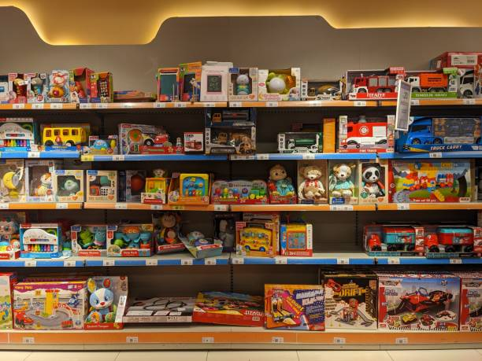
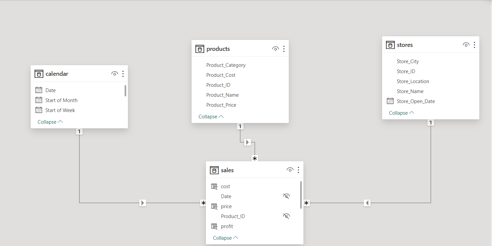
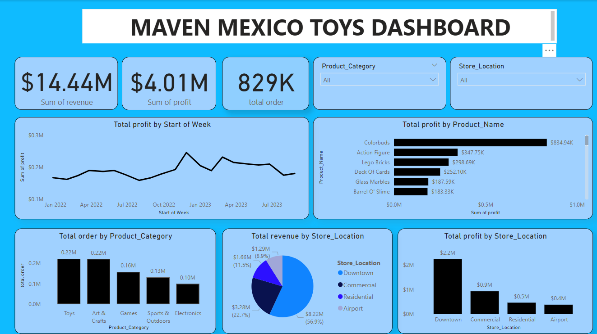

# TOY SALES ANALYSIS

## INTRODUCTION
This Project provides a brief overview of Maven Toys Sales data dashboard that includes its purpose and targets. The project answers crucial questions and help the company make data-driven decisions.

**_Disclaimer_** : Datasets is just a dummy dataset to demonstrate the capababilities of Microsoft Power BI, It does not demonstrate any company. 🏃

## PROBLEM STATEMENT
1.	Which store location has the highest revenue?
2.	What is the total profit by Product Name?
3.	What is the total Revenue by location?
4.	What is the total revenue, total profit, total orders?

## SKILLS DEMONSTRATED
Microsoft Power BI skills featured include:
-  DAX,
-  Modelling,
-  Quick measure,

## Modelling

The model is a star schema
There are a 4-dimension tables. The tables are joined to the table with a one-to-many relationship on the primary key.

## Visualisation

The visualisation shows key metrics that include,total order by product category, total revenue by store location, total profit by store location, weekly trend by profit and other KPIs.

## INTERACTIVITY 
😃You can interact with the report [here](https://app.powerbi.com/view?r=eyJrIjoiNTA4NDYxZjUtYWM0Ni00ODliLTlkMzctY2I5YTlmMzA3MGMxIiwidCI6IjU0MzUwMDM0LWVhYTMtNGMyZC1hYmZhLTY0MGRmMDYyNjNhOCJ9)

Users can filter data by product category, store location to focus on specific aspects of the sales performance

## Conclusion

-  Toys has the highest total order by product category with 221,222 order followed by Arts and crafts with 220,673 orders in that other
-  Downtown has the highest profit by store location followed by commercial, Residential and Airport
-  There was 829k orders with a total revenue of 14.44million dollars 🤓
